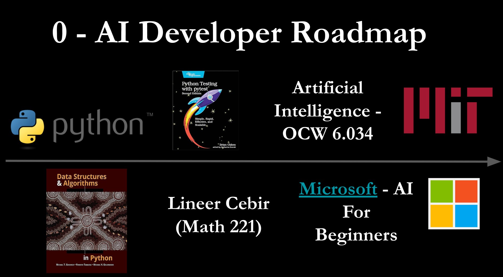
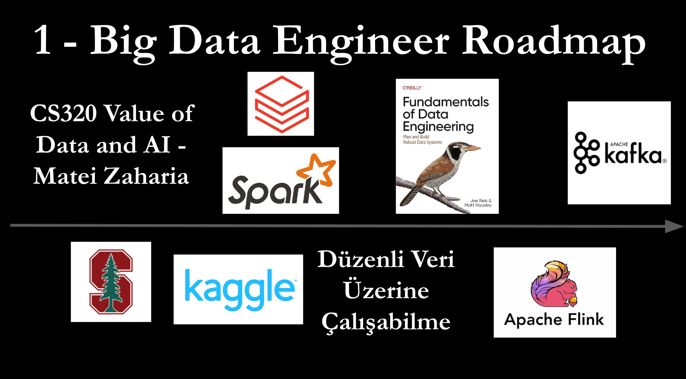

# yapayzeka (yol haritası) 🌏

## Merhaba 👋

Dünyayı değiştiren bu teknolojiyi kullanan, benzersiz problemler çözen insanlardan birisi olmak istiyorsan, doğru yerdesin. 

Aradığın her şey ve fazlası, burada tek bir çatı altında. 😊

---

İki farklı yol haritasından bahsetmiştik (Büyük Veri Analizi ve Bilgisayarlı Görü). 

Fakat başlangıçta, bu iki yolun bir kesişim noktası bulunuyordu. 💕

Tüm içeriği, aşağıda açıklamaları ile bulabilirsin.

---

## İçindekiler

0. [Yapay Zeka Yol Haritası](#yz)
1. [Büyük Veri İşleme Yol Haritası](#big_data)
2. [Bilgisayarlı Görü Yol Haritası](#cv)
3. [Sinyal/Gürültü Oranı En Yüksek Konuşmalar](#talks)
---

## 0 - Yapay Zeka Yol Haritası 🔮 

### Python 🐍

Bir programlama dilini iyi öğrenmek, kariyerinde temel becerilerinden birisi olacak.

Yapay Zeka üzerinde geliştirilen araçlar, akademik çalışmalar ve araştırma baskın şekilde Python ile yapılıyor.

Bunun için birçok kaynak mevcut: [Fluent Python](https://www.amazon.com.tr/Fluent-Python-Concise-Effective-Programming/dp/1492056359). [Python Cookbook](https://www.amazon.com.tr/Python-Cookbook-Recipes-Mastering-No/dp/1449340377). [Python Tricks](https://www.amazon.com/Python-Tricks-Buffet-Awesome-Features/dp/1775093301).

Bir dile hakim olduğunu hissetmek, uzun bir zaman alacak. 

Fakat bu noktaya eriştiğinde artık hiçbir dil sana korkutucu gelmeyecek.

Java, Scala, C, C++, Rust..

Gönder gelsin 😍

### Data Structures and Algorithms in Python 🌟

Veri Yapıları ve Algoritmalar, aslında dillerin üzerinde seviyede (veya temel gibi düşünürsek, altında) bir konu.

Bu konuda, benim tavsiye ettiğim kitap [şurada.](https://www.amazon.com.tr/Structures-Algorithms-Python-Michael-Goodrich/dp/1118290275).

Bu kitap 723 sayfa. Bu korkutucu gelebilir, fakat söz veriyorum, kitabın tamamını okumaya değiyor. 💮

Çünkü kitap, [üst seviye](https://www.tutorialspoint.com/difference-between-high-level-language-and-low-level-language) bir dil olan Python ile, bir bilgisayarın çalışma prensibi arasındaki ilişkiyi; tüm veri yapılarının nasıl icat edildiklerini ve nerelerde kullanıldıklarını anlatıyor.

Ayrıca, buradaki bilgeliğin, mülakatlarında da sana çok yardımcı olacak. Paha biçilemez bir beceri.

### Python Testing with pytest 🐪

Python ile geliştirme yapacağını düşünürsek, katıldığın kaliteli geliştiricilerden oluşan ekipte, unittest yazmak klasik bir beklenti olacak.

Bu alışkanlığı edinmek için, olabilecek en basit test kütüphanelerinden birisi olan pytest ile başlamak, yerinde bir tercih.

Keşfe çıkmak için, kitap linki [şöyle.](https://www.amazon.com/dp/1680508601/ref=emc_bcc_2_i)

### Lineer Cebir - Math 221 BOUN  🐋

Matris ifadeleriyle matris transpozunu alma, tersini alma, öteleme ve diğer cebirsel işlemleri kullanamayı bilmen gerekiyor.

Bu konvolüsyon için de geçerli. Derinlere inmesen de, temel işlemlere hakim olmalısın.

Ayrıca, türev alabilmen, ve bir fonksiyonun maksimumunu türevinin 0 olduğu yerde keşfedebilmen, temel beceriler arasında sayılabilir.

Herhangi bir Lineer Cebir dersini, anlayarak tamamlamış olman, başlangıç seviyesi için yeterli.

### [6.034 | Fall 2010](https://ocw.mit.edu/courses/6-034-artificial-intelligence-fall-2010/pages/syllabus/) | Undergraduate | Artificial Intelligence | MIT OCW 🌁

MIT'nin efsanevi profesörü, Patrick Henry Winston tarafından veriliyor. 

Bu dersin içeriğine bir başucu kitabı gibi yaklaşman, ders planında bahsi geçen anahtar kelimelerin neler olduğunu anlaman harika olur.

Başlayıp hemen bitirmek zorunluluk değil, ara sıra ziyaret ettiğin, sevdiğiniz bir dizi gibi yaklaşabilirsin.

### [Artificial Intelligence for Beginners | Microsoft ](https://microsoft.github.io/AI-For-Beginners/) 🌈

Yapay Zekanın, ne olup, ne olmadığını anlatan, rengarenk, eğlenceli bir içerik.

Bu içerikle, zihninde, bilmediğini bile bilmediğin sorular cevaplanmış olacak.

### The Hundred-Page Machine Learning Book [Amazon](https://www.amazon.com.tr/Hundred-Page-Machine-Learning-Book/dp/199957950X) - [Github](https://github.com/tirthajyoti/Papers-Literature-ML-DL-RL-AI/blob/master/General-Machine-Learning/The%20Hundred-Page%20Machine%20Learning%20Book%20by%20Andriy%20Burkov/Links%20to%20read%20the%20chapters%20online.md) - [pdf](http://ema.cri-info.cm/wp-content/uploads/2019/07/2019BurkovTheHundred-pageMachineLearning.pdf)

141 sayfada, en çok kullanılan kısımları ile, Machine Learning'i anlayabilmek adına mükemmel bir kaynak.

Kitap önce oku sonra satın al düşüncesi ile, herkese açık erişimde. 

PDF'ten okumaya başladığınızda, bir an önce satın almak isteyeceksiniz. 😊

### [Introduction to Machine Learning Interviews Book](https://huyenchip.com/ml-interviews-book/)

Chip Huyen, sektörde en çok referans gösterilen [Designing Machine Learning Systems](https://www.amazon.com/Designing-Machine-Learning-Systems-Production-Ready/dp/1098107969) kitabının yazarı.

Google, Nvidia, Netflix, Snapchat ve Snorkel.ai gibi şirketlerden teklif almasının yanında, Nvidia ve Snorkel.ai'da mülakat hazırlayan bir insan.

Bu kitabın içeriğini günde 30 dakika okumak, gelecekte yapacağınız bir başvuruda, en güçlü kozlarınızdan birisi olabilir. 😍

---

## 1 - Büyük Veri İşleme Yol Haritası 🎪 

### CS320 Value of Data and AI - Matei Zaharia 🌀

Her gün kullandığınız uygulamaların, verinizle neler yaptığını öğrenmek ve verinin yapay zeka uygulamalarında değerini anlamak için enfes bir ders.

Ders linki [şurada.](https://canvas.stanford.edu/courses/114221/files/folder/Lecture%20Slides) Dersi veren kişi Matei Zaharia. 

Dersin cevapladığı sorular:
- Şirketler verilerinizi nasıl kullanıyor, satın alıyor ve satıyor?
- Veri ve yapay zeka ürünlerine yönelik iş modelleri nelerdir?
- Veriler ve yapay zeka ürünleri nasıl değerlendiriliyor?
 
### Databricks 🚣

Matei'nin Spark'ı Apache Foundation'a devrettikten (açık kaynaklı yaptıktan) sonra kurduğu şirket.

Harika bir Apache Spark eğitimleri mevcut ve bu eğitim ücretsiz. Sonrasında isterseniz sertifika almanız da mümkün. 🐤

### Apache Spark ✏️

Spark bir veri mühendisinin tek bir araç kullanarak birden fazla iş yapabilmesi için oluşturulmuş, birleşik bir veri işleme motoru.

Endüstride sıklıkla karşına çıkacak, çünkü açık kaynaklı ve büyük bir topluluğa sahip.

Hem Python'da hem Scala hem de Java'da geliştirme olanağı sunuyor. Kabiliyetlerini anlamak için [şurayı](https://spark.apache.org/) inceleyebilirsin.

Spark'ı oluşturan insandan bir kitap: [Spark: The Definitive Guide: Big data processing made simple](https://www.amazon.com.tr/Spark-Definitive-Guide-Bill-Chambers/dp/1491912219) , ve Databricks ekibinin oluşturduğu daha güncel kitap [Learning Spark: Lightning-Fast Data Analytics](https://www.amazon.com/Learning-Spark-Jules-Damji/dp/1492050040):

### Kaggle 🎢

Büyük Veri Analizi yapabilmek için, veriye ihtiyacın olacak.

Gerçek dünyada veri, hiçbir hazır veri setine benzemese bile, veri setleri üzerinde temel modellerin geliştirilmesini öğrenmek için Kaggle harika bir site.

Ayrıca, öznitelik mühendisliği becerini geliştirmen (Feature Engineering) elde ettiğin sonuçlarda metrik başarını belirleyen temel yetkinliklerden birisi olacak.

### Fundamentals of Data Engineering  📕

Bu kitap, veri mühendisliğinin ana çerçevesi ile yeni kavramlar arasında iyi bir denge sağlıyor. Okuması çok keyifli.

Kitap linki [şurada.](https://www.amazon.com/Fundamentals-Data-Engineering-Robust-Systems/dp/1098108302)

### Apache Flink 🍊

Apache Flink, canlı veri akışları üzerinde durum bilgisi olan hesaplamalar için oluşturulmuş, dağıtık bir işleme motoru.

Yine endüstride sıklıkla karşına çıkacak. Kullanım senaryoları için [şurayı](https://flink.apache.org/what-is-flink/use-cases/) inceleyebilirsin.

### Apache Kafka 🍎

Verinin servisler, prosesler ve konteynırlar arasında taşınmasını sağlayan, muhtemel olarak sıklıkla kullanacağın bir araç.

Üst seviyeden nasıl çalıştığını öğrenmek yeterli gibi gelse de, derinlemesine öğrenmek istersen, kitap: [Kafka: The Definitive Guide: Real-Time Data and Stream Processing at Scale.](https://www.amazon.com/Kafka-Definitive-Real-Time-Stream-Processing/dp/1491936169)

---

## 2 - Bilgisayarlı Görü Yol Haritası 📹 

### CS 131 Computer Vision: Foundations and Applications 🏯

Modern yapay zeka uygulamalarının kalbinde, karmaşık dünyayı algılayabilen, anlayabilen ve yeniden yapılandırabilen bilgisayarlı görme teknolojileri yatıyor.

CS131 ile, en baştan itibaren, temel olarak öğrenmeniz gereken neredeyse her şey ile karşılaşmış olacaksın.

Lisans bitirme tezimde, [dersin notları](https://github.com/StanfordVL/CS131_notes) bana çok yardımcı olmuştu. 😌

Ben [2019](http://vision.stanford.edu/teaching/cs131_fall1920/) yılını seviyorum. Eğer istersen [diğer yıllara](http://vision.stanford.edu/teaching/cs131_fall2021/) da bakabilirsin.

2019 için, ders sunuları [şurada.](http://vision.stanford.edu/teaching/cs131_fall1920/syllabus.html)

### Computer Vision: A Modern Approach 📙

Bir başucu kitabı. Takıldığın bir yerde başvurmalık, eğer tavşan deliğine dalmak istersen de enfes bir kaynak.

Kitap linki [şöyle.](https://www.pearson.com/en-us/subject-catalog/p/computer-vision-a-modern-approach/P200000003374/9780133001921)

### CS231n: Deep Learning for Computer Vision 🌠

Bu, dünya üzerinde CV çalışmak isteyen herkesin alması gereken bir ders. 

2016 Kış döneminde açılış dersini [Fei Fei Li](https://profiles.stanford.edu/fei-fei-li) veriyor. CV tarihini öğrenmek ve bu bilinçle gelişmek harika bir fırsat.

Dersi Stanford'ta açan ilk insan, [Andrej Karpathy](https://karpathy.ai/). Kendisi Tesla'da Yapay Zeka direktörüydü. Enfes bir YouTube hesabı var. Gerçek bir eğitmen.

Dersin [içeriğini şuradan](http://cs231n.stanford.edu/) inceleyebilirsin. Eğer Karpathy'den dersi dinlemek istersen, çalma listesinin [ilk videosu](https://www.youtube.com/watch?v=NfnWJUyUJYU) şöyle.

### PyTorch 🍓

PyTorch, GPU'ları ve CPU'ları kullanarak derin öğrenme için optimize edilmiş bir tensör kütüphanesi.

Endüstri standardı, bazılarının deyişi ile defacto.

Kendilerinin oluşturduğu enfes bir başlangıç kiti [şöyle](https://pytorch.org/tutorials/beginner/basics/intro.html). 

### Tensorflow 🍍

TensorFlow, makine öğrenimi için ücretsiz ve açık kaynaklı bir yazılım kütüphanesi. Google mühendisleri ve araştırmacıları tarafından geliştirildi.

Endüstride yine sıklıkla kullanıldığını göreceksin. Eğer öğrenmek istersen, özenle oluşturulmuş [bir içerik](https://www.tensorflow.org/learn) seni bekliyor.

---

Bu repo, geliştirilmeye devam edecek. 

Eğer sen de farklı kaynaklar eklemek istersen, PR oluşturabilirsin.  😊

---

## 3 - Sinyal/Gürültü Oranı En Yüksek Konuşmalar 🌳 

### [Introduction to LLM's](https://www.youtube.com/watch?v=zjkBMFhNj_g)

Andrej dil modelleri hakkında, kendi ifadesi ile “Meşgul insanlar Dil Modellerine Giriş“ üzerine enfes bir içerik oluşturmuş.

### [Andrew Ng: Opportunities in AI - 2023](https://www.youtube.com/watch?v=5p248yoa3oE)

Alanda en saygın insanlardan birisi, Andrew NG'den, özellikle Supervised Learning ile çözülebilecek daha birçok problem olduğunu keşfetmek ve derinleşmek adına. 

### [Yann LeCun, Meta and NYU - "Objective-Driven AI: Towards Machines that can Learn, Reason, and Plan"](https://www.youtube.com/watch?v=d_bdU3LsLzE)

Yann, Meta'da Chief AI Scientist. Dil Modelleri ve Üretken Yapay Zeka üzerinde bakış açısını paylaşıyor. Ona göre, AGI'a erişim adına, daha çok yolumuz var.

### [The Autopilot Stack at Tesla](https://youtu.be/FwT4TSRsiVw?t=90)

Başlangıçtan bu yana, Tesla'nın otopilot geliştirme problemine yaklaşımının özeti, yine Andrej'den. İlham verici.

---

## Hatırlatma 🎉

Öğrenmek [sonsuz bir merdivene tırmanmak](https://visualizevalue.com/blogs/visuals/learning) gibi. Yükseldikçe, henüz göremediğin şeyleri göreceksin.

Yaşasın aktif öğrenme. 

