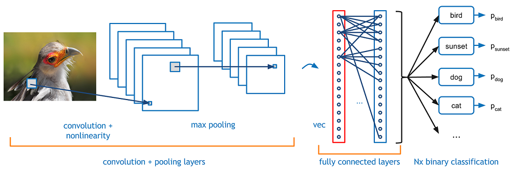
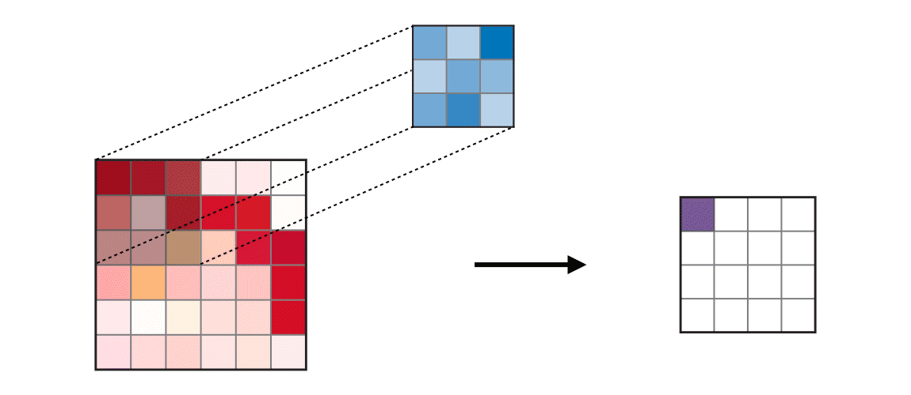

# Yapay Zeka - Artificial Intelligence 🤔

Hoşgeldin ☺️

Bu repository (depo) yapay zeka hakkında yapmak isteyebileceğin araştırmalarda sana bir pusula 🧭 olarak eşlik etmek için var.

  

Yapay Zeka teknolojisi hakkında heyecan verici olan şey, **şu anda** hayatımızın içinde, neredeyse her alanda var olması.

Buna, Dota 2 gibi E-spor oyunlarında [profesyonellere karşı galip gelmiş modeller](https://openai.com/five/), müzikleri ünlü virtüözlerin tarzında [yeniden oluşturan yapılar](https://openai.com/blog/musenet/) ve seni mobil uygulamarında daha uzun süre tutmak için yarış halinde olan platformların [öneri algoritmaları](https://www.amazon.science/the-history-of-amazons-recommendation-algorithm) dahil.

En çok kullanılan sosyal medya platformlarını ele alalım.

Bunların geliştiricileri arasında yapay zeka teknolojisinden yararlanmayan tek bir şirket yok. Örnek olarak [Instagram](https://ai.facebook.com/blog/powered-by-ai-instagrams-explore-recommender-system/), [Tiktok](https://www.argoid.ai/blog/the-ai-algorithm-that-got-tiktok-users-hooked#toc-under-the-hood-possible-recommendation-workflow-) ve [Snapchat](https://www.cnbc.com/2021/01/26/snap-acquires-ariel-ai-to-boost-snapchat-augmented-reality-features.html)'i verebiliriz. 

---

### Ne oluyor ya ?

  

Yapay Zeka hakkında bilgiye erişmek, internet üzerinde yapılabilecek en kolay şeylerden biri.

2012'de, Konvolüsyonel Sinir Ağları ([Stanford'dan Ücretsiz Bir Kaynak](https://stanford.edu/~shervine/teaching/cs-230/cheatsheet-convolutional-neural-networks)) nesne tespiti konusunda performanslarını kanıtlandığı andan itibaren [Alexnet](https://towardsdatascience.com/alexnet-the-architecture-that-challenged-cnns-e406d5297951), [YOLOv3](papers/yolov3.pdf), [Inception-v4](papers/Inception-v4.pdf) bilgisayarlı görü alanında devrim niteliğinde makaleler oldu.

  

Bu makaleleri ilk sefer açtığında, içerikleri sana biraz ağır gelebilir. 

*mAP, Feature Map, Logistic Regression, ResNet-152 ..*

Fakat güzel haberlerim var. 😉

Bu alandaki en eğlenceli bilim insanlarından birisi, [Joseph Redmon](https://pjreddie.com/)'un  YOLOv3'ün kabiliyetlerini gösterdiği video şöyle. ✨

YOLOv3 ve ismi geçen her bir modelin yapısında, bazı matematiksel işlemler yapmaya yarayan temel katmanlar var.

Tıpkı legolar gibi.

  

En Büyük Kaleler, En Küçük Parçalarla. 

En basit anlamda, konvolüsyon katmanlarını, bir matris çarpımı olarak düşünebilirsin.

  

Bir yapay zeka modelinin, belirli bir nesneyi tanıyarak bize raporlamasının temelinde bu işlem var. Buradan itibaren her parçayı birbiri üzerine ekleyip, model 

### Makineler Nasıl Öğrenir ?

Bu konuda, bugüne kadar izlediğim en eğlenceli video 😅:

## Teknolojinin Liderleri Kimler ?

Yapay Zeka kullanılarak geliştirilmiş en büyük projelerin ekipleri aşağıdaki gibi:

  
  
  
  
  

Bu dünyayı araştırmak, keşfetmek, çok keyifli. Aklına takılan herhangi bir şeyi [sormaktan çekinme](mailto:sezaiburakkantarci@gmail.com) 🌟

[Boğaziçi Savunma Sanayi Zirvesi'nde paylaşılan içerik hakkında ayrıntılı bilgiler &amp; kaynaklar içerir.]: # (This is a comment)
